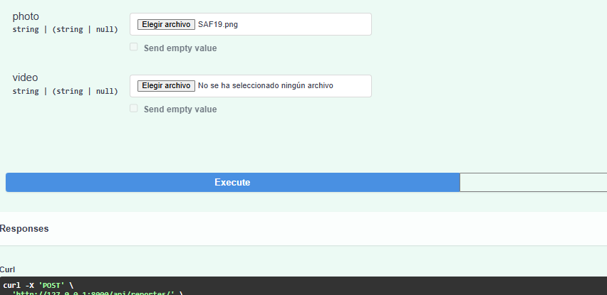

# Casos de Prueba

# Para el primer caso de uso

Por medio la API del backend se puede registrar un incidente con sus caracteristicas con el endpoint POST /api/reports

Se puede subir imagenes y videos

# Para el segundo caso de uso

Por medio la API del backend se puede visualizar un incidente con sus caracteristicas con el endpoint GET /api/report/{report_id}

