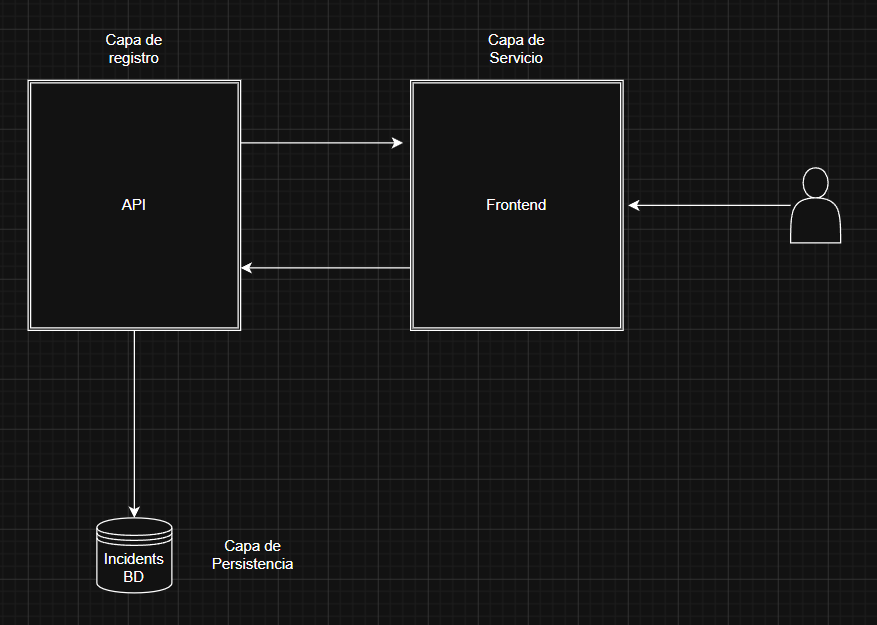

# SRS - PARCIAL

## Descripción General

El sistema de registros de incidencias de inseguridad ciudadana se concibe como una plataforma digital independiente orientada a mejorar la comunicación entre los ciudadanos y las autoridades responsables de
la seguridad.

## Funcionalidad
El sistema de seguridad ciudadana proporcionará un conjunto de funcionalidades orientadas al registro de incidentes con el fin de tener datos y que puedan ser utilizados para mejorar la gestión de las autoridades en la seguridad ciudadana.

## Usuarios
Ciudadano es el usuario final del sistema que reporta y registra incidentes de seguridad.

## Casos de Uso

### 1. Registro de incidentes:
- Actor: Ciudadano o usuario final
- El actor tiene como objetivo reportar un crimen o hecho sospechoso que ocurrio por su zona
- Pasos:
    - El actor abre la pagina
    - Completa un formulario con el tipo de incidente, ubicacion, descripcion, prueba (foto o video), fecha y hora
    - Envia el reporte
- Como resultado, el incidente queda registrado y visible para su revision.

### 2. Visualizacion y seguimiento de incidentes:

- Actor: Cuidadano
- Ver los incidentes registrados
- Pasos: 
    - El actor accede a la lista de incidentes
    - Selecciona un incidente, puede observar la incidencia
- Como resultado hay un historial simple de gestion de incidentes.

### 3. Generacion de un informe por zona
- Actor: Ciudadano
- Obtener un resumen de la situacion de la zona
- Pasos:
    - El actor seleciona generar un informe segun la zona solicitada
    - Se emite un informe resumida de los incidentes de la zona
- Como resultado obtiene un informe que puede ser utilizado para otro fines.

## Requisitos de software

El sistema se integrará con los siguientes componentes de software:
- Base de datos para almacenamiento de información de los registros
- Servidor web para el procesamiento de registros
- Servidor web para el procesamiento de generacion de informes.

### Requerimientos funcionales

- RF1: Un endpoint para crear incidentes con campos
- RF2: Un endpoint para listar incidentes
- RF3: Un endpoint para el detalle del incidente
- RF4: Un endpoint para el resumen por zonas

## Arquitectura

La arquitectura del proyecto es una aplicación en tres capas: 
Un frontend que consume una API REST construida con FastAPI, la cual expone endpoints para registrar, listar y reportar incidentes; dicha API usa modelos SQLAlchemy para persistir datos en una base (Postgres) y guarda archivos en una carpeta uploads persistida, mientras que la orquestación y despliegue en contenedores se maneja con Dockerfile y docker-compose.yml para ejecutar el servicio backend y la base de datos.

